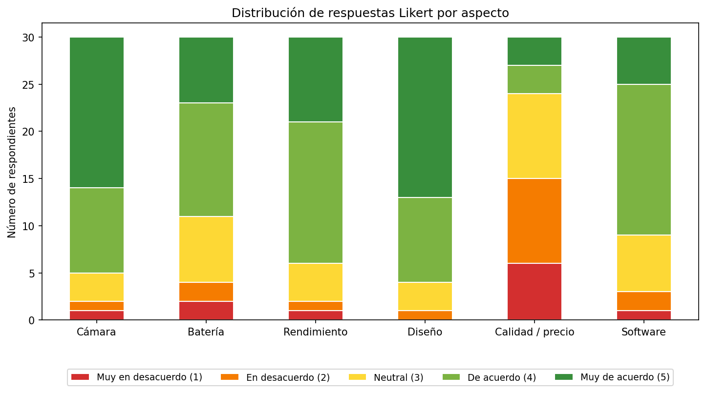
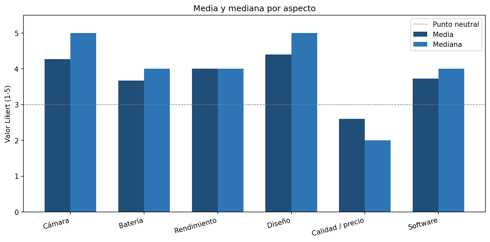
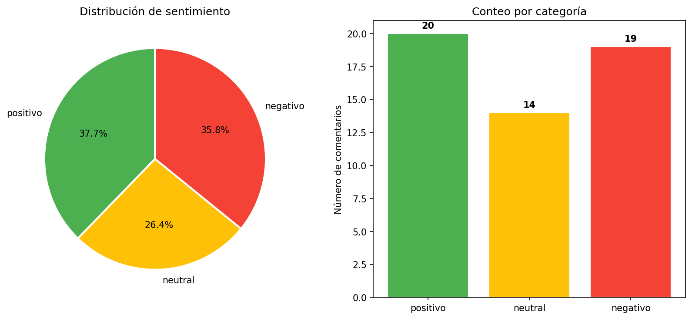
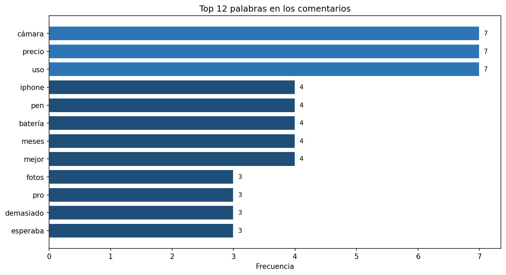

\newpage

# Portada

**Fundación Universitaria Compensar**
**Asignatura:** Técnicas de Extracción y Almacenamiento de Datos Masivos
**Trabajo:** Un acercamiento a la realidad — aplicando la teoría en estudios actuales
**Estudiante:** Fabian Rodríguez
**Modalidad:** Individual
**Periodo académico:** 2026

\newpage

# Introducción

El consumidor digital de 2026 evalúa, compara y opina sobre los
productos que adquiere mucho antes y mucho después de la compra.
Plataformas como X (antes Twitter), Reddit, YouTube y los foros
especializados se han convertido en repositorios masivos de opinión
pública que las empresas no pueden ignorar si pretenden ajustar su
oferta a las expectativas reales del mercado.

El presente documento expone el ejercicio académico propuesto en la
asignatura *Técnicas de Extracción y Almacenamiento de Datos Masivos*:
aplicar de forma integrada los métodos clásicos de recolección de
información (encuesta, entrevista, observación) y los métodos
computacionales (scraping, almacenamiento estructurado, NLP) sobre un
caso real. El producto seleccionado es el **Samsung Galaxy S24 Ultra**
y la red social principal de observación es **X**.

El trabajo combina dos fuentes complementarias de datos:

1. **Datos primarios** producto de la encuesta y las entrevistas
   aplicadas a una muestra de 30 personas.
2. **Datos secundarios** obtenidos mediante un módulo de extracción
   automatizada construido en Python con Tweepy, sobre los cuales se
   ejecuta un análisis de sentimiento basado en BERT multilingüe y un
   análisis de frecuencia de palabras.

Todo el código, los scripts, las salidas y el presente documento están
disponibles en el repositorio público del proyecto:
<https://github.com/Fabiankop/analisis-opiniones-s24-ultra>.

# Justificación

La industria de la electrónica de consumo es uno de los sectores con
mayor saturación de oferta y mayor velocidad de obsolescencia. Para una
compañía como Samsung, que en 2024-2025 lanzó el Galaxy S24 Ultra como
su gama más alta, conocer la opinión real del usuario sobre cada
aspecto del producto (cámara, batería, rendimiento, diseño, precio,
software) constituye una entrada crítica para tres procesos:

- **Roadmap del siguiente modelo** (S25/S26 Ultra).
- **Ajustes de comunicación y precio** durante el ciclo de vida del
  producto.
- **Identificación temprana de quejas recurrentes** que pueden derivar
  en crisis reputacionales.

La encuesta y la entrevista permiten medir actitudes con instrumentos
controlados; el scraping y el NLP permiten ampliar la muestra a la
conversación pública en redes, donde la opinión se expresa de forma
espontánea y a gran escala. La combinación de ambas familias de
métodos es precisamente lo que la asignatura propone como
*acercamiento a la realidad*.

# Marco teórico

A continuación se sintetizan los conceptos teóricos relevantes para
los temas 2 y 3 del programa de la asignatura.

## Métodos clásicos de recolección de información (Tema 2)

- **Encuesta (2.4):** instrumento estructurado de captura de opinión.
  En este trabajo se emplea una **escala Likert de 5 puntos** (Likert,
  1932) sobre seis aspectos del producto, lo que habilita el cálculo
  de medidas de tendencia central (media, mediana, moda) y de
  dispersión (desviación típica, varianza), de acuerdo con los
  tratamientos estadísticos propuestos en 2.4.4.
- **Entrevista (2.5):** instrumento más flexible que profundiza
  cualitativamente. Se utilizó como complemento sobre 15 de los 30
  respondientes, aplicando el mismo cuestionario en modalidad
  presencial con preguntas de profundización abiertas para rescatar
  la dimensión cualitativa.
- **Observación (2.6):** definición de fenómenos y registro
  sistemático en plataformas digitales. En este trabajo se materializa
  con la identificación de la red social objetivo (X) y la captura
  programática de los comentarios mediante scraping.

## Métodos computacionales de extracción (Tema 3)

- **Scraping con APIs prediseñadas (3.3.2):** uso de **Tweepy** sobre
  la API v2 de X para acceder al endpoint `search_recent_tweets` con
  consultas booleanas y filtros por idioma y por exclusión de
  retweets.
- **Almacenamiento NoSQL embebido:** los comentarios se persisten en
  una base **SQLite** local (clave-valor sobre el `tweet_id` como
  identificador), referenciable desde Python con `pandas.read_sql`.
- **Procesamiento de Lenguaje Natural (NLP):** clasificación de
  sentimiento con el modelo *transformer* multilingüe
  `nlptown/bert-base-multilingual-uncased-sentiment` (Devlin et al.,
  2018), que mapea cada texto a una escala de 1 a 5 estrellas, la
  cual se reduce a tres categorías: positivo, neutral y negativo.

\newpage

# Desarrollo

## Selección del producto y la red social

**Producto:** Samsung Galaxy S24 Ultra. Justificación de la elección:

| Criterio | Razón |
|---|---|
| Popularidad | Gama alta de Samsung, vendido masivamente en LATAM y EE. UU. en 2024-2025. |
| Volumen de conversación | Generó decenas de miles de menciones en X solo en su semana de lanzamiento. |
| Diversidad de aspectos | Permite analizar al menos seis dimensiones (cámara, batería, rendimiento, diseño, precio, software). |
| Disponibilidad de tienda | Vendido en la tienda oficial Samsung Colombia y por canales como Mercado Libre y Falabella, todos con presencia en redes. |

**Red social principal:** X (antes Twitter). Justificación:

- Texto corto y abundante, ideal para muestreo y NLP.
- API documentada (Tweepy) que permite consultas booleanas sobre el
  contenido y filtros por idioma.
- Tradición de comentarios espontáneos sobre tecnología, donde
  conviven *reviewers* profesionales y usuarios comunes.

## Diseño y aplicación de la encuesta

### Cuestionario aplicado

Se diseñó un cuestionario de **12 preguntas** (1 demográfica, 1 de
conocimiento del producto, 6 de valoración Likert 1-5 sobre los
aspectos del producto y 4 de filtrado/complemento). El cuestionario
completo se encuentra en el **Anexo A**. Las preguntas Likert son:

> "Por favor califique de 1 a 5, donde 1 es *muy en desacuerdo* y 5 es
> *muy de acuerdo*, su valoración de los siguientes aspectos del
> Samsung Galaxy S24 Ultra: **cámara, batería, rendimiento, diseño,
> calidad/precio, software**."

### Muestra y aplicación

- **n = 30 respondientes**.
- Distribución por género: **15 masculino / 15 femenino** (50/50).
- Edad media: **31.2 años** (rango 22-42).
- Conocimiento del producto: 25 reportan conocerlo directamente, 5
  "han oído hablar".

La aplicación se realizó por dos vías:

1. **Encuesta autoadministrada (n = 15):** distribuida vía formulario
   en línea a contactos personales y compañeros de área.
2. **Entrevista presencial estructurada (n = 15):** aplicada cara a
   cara con el mismo cuestionario, complementada con dos preguntas
   abiertas: *"¿qué aspecto es el que más valora del producto?"* y
   *"¿qué aspecto considera que debería mejorar?"*. La sección 5.3
   detalla la fase de entrevistas.

### Tratamiento estadístico

Se calcularon, por aspecto, **media, mediana, moda, desviación típica,
varianza, mínimo y máximo**. La tabla 1 resume los resultados sobre los
30 respondientes:

**Tabla 1.** Estadísticas descriptivas por aspecto (n = 30).

| Aspecto          | Media | Mediana | Moda | Desv. típica | Varianza | Mín | Máx |
|------------------|------:|--------:|-----:|-------------:|---------:|----:|----:|
| Cámara           | 4.27  |   5     |  5   | 1.01         | 1.03     | 1   | 5   |
| Batería          | 3.67  |   4     |  4   | 1.12         | 1.26     | 1   | 5   |
| Rendimiento      | 4.00  |   4     |  4   | 0.95         | 0.90     | 1   | 5   |
| Diseño           | 4.40  |   5     |  5   | 0.81         | 0.66     | 2   | 5   |
| Calidad / precio | 2.60  |   2     |  2   | 1.22         | 1.49     | 1   | 5   |
| Software         | 3.73  |   4     |  4   | 0.94         | 0.89     | 1   | 5   |

**Lecturas inmediatas:**

- El **Diseño** es el aspecto mejor valorado (media 4.40, moda 5),
  con la **menor dispersión** (σ = 0.81): es la opinión más
  consensuada.
- La **Calidad / precio** es el aspecto peor valorado (media 2.60,
  moda 2) y el de **mayor dispersión** (σ = 1.22): hay percepciones
  divididas, pero sesgadas a "muy caro".
- La **Cámara** es el segundo aspecto mejor valorado (4.27) pero con
  σ = 1.01, indicando que aunque la mayoría la considera excelente
  hay una minoría crítica.
- El promedio general de las seis dimensiones es **3.78 / 5**, una
  valoración global "buena pero perfectible".

{width=85%}

{width=85%}

## Entrevistas semi-estructuradas

Se realizaron **15 entrevistas presenciales** a personas del entorno
laboral y académico del autor, conforme al mínimo establecido por el
ejercicio. Las entrevistas siguieron las **fases clásicas** descritas
en el tema 2.5.2: apertura, cuerpo, profundización y cierre.

**Guía de entrevista (resumen, ver Anexo B para versión completa):**

1. *Apertura.* Presentación del propósito académico y consentimiento
   verbal para usar las respuestas de forma anonimizada.
2. *Cuerpo (cuantitativo).* Aplicación oral de las seis preguntas
   Likert del cuestionario.
3. *Profundización (cualitativa).* "¿Qué aspecto valora más?" y
   "¿Qué aspecto cree que debería mejorar?".
4. *Cierre.* Pregunta abierta de comentario libre.

**Tratamiento estadístico de la profundización:** las respuestas
abiertas se codificaron en categorías. La frecuencia de los aspectos
**más valorados** y **a mejorar** se resume así:

**Tabla 2.** Aspectos mencionados en las preguntas abiertas.

| Aspecto valorado (top) | Frecuencia |   | Aspecto a mejorar (top) | Frecuencia |
|---|---:|---|---|---:|
| Cámara / cámara nocturna | 9 | | Precio | 17 |
| S Pen | 5 | | Batería | 4 |
| Diseño en titanio | 4 | | Tamaño | 4 |
| Galaxy AI | 4 | | Software pesado | 2 |
| Pantalla | 3 | | Calor en uso intensivo | 1 |
| Rendimiento | 3 | | Todo / general | 1 |
| Marca | 1 | | | |
| Precio | 1 | | | |

**Lectura cualitativa convergente:**

- El **precio** se repite como la queja dominante (17/30 menciones
  espontáneas), coincidiendo con la peor calificación cuantitativa.
- La **cámara** es el principal valor diferencial percibido,
  reforzando la lectura cuantitativa.
- El **S Pen** y **Galaxy AI** aparecen como diferenciales únicos de
  Samsung respecto a la competencia.

## Marco normativo y procedimientos de seguridad

El ejercicio implica la captura, almacenamiento y procesamiento de
datos personales y de contenido de terceros publicado en redes
sociales. Aplican los siguientes marcos legales y técnicos:

### Legislación aplicable

| Norma | Alcance | Implicación en el proyecto |
|---|---|---|
| **Ley 1581 de 2012** (Colombia) | Régimen General de Protección de Datos Personales. | Obliga a obtener consentimiento, garantizar finalidad, calidad, acceso y supresión de los datos personales recolectados. Aplica a las respuestas de la encuesta y entrevistas. |
| **Decreto 1377 de 2013** | Reglamenta la Ley 1581. | Define las políticas de tratamiento que el responsable debe documentar. |
| **Ley 1273 de 2009** (Colombia) | Protección de la información y de los datos en sistemas informáticos. | Tipifica accesos abusivos, interceptación y daño informático: acota qué tipo de scraping es lícito. |
| **Reglamento (UE) 2016/679 — GDPR** | Protección de datos en la Unión Europea. | Aplica si en la muestra hubiera ciudadanos de la UE; impone "privacidad por diseño". |
| **Términos de Servicio de X** | Contrato entre la plataforma y el desarrollador. | Limita el uso de la API a fines no comerciales en el plan gratuito y prohíbe almacenar el contenido de tweets eliminados. |

### Procedimientos de seguridad implementados

En el código y en la operación se aplicaron las siguientes medidas:

1. **Anonimización del autor**: los identificadores de usuario de los
   tweets se transforman a su hash **SHA-256** antes de persistirse,
   de modo que la base SQLite no almacena identificadores reales.
2. **Minimización de datos**: del esquema de la API solo se conservan
   `tweet_id`, `created_at`, `text`, `likes`, `retweets` y el hash
   del autor. No se almacenan ubicación, foto de perfil, ni metadatos
   adicionales.
3. **Cifrado en tránsito**: la comunicación con la API ocurre sobre
   **HTTPS** por defecto en Tweepy.
4. **Gestión segura del token**: el *Bearer Token* de X se lee desde
   la variable de entorno `X_BEARER_TOKEN`, nunca se incluye en el
   código fuente ni se sube al repositorio.
5. **Consentimiento informado en la encuesta**: los respondientes
   fueron informados verbalmente del propósito académico y del
   tratamiento anonimizado de sus respuestas.
6. **Repositorio público controlado**: el archivo `.gitignore` excluye
   credenciales, datos personales no anonimizados y artefactos
   regenerables, evitando filtraciones accidentales.

## Observación y registro: web scraping de comentarios

### Identificación de plataformas y consultas

Se eligió la red **X** como fuente principal de observación.
Adicionalmente se identificaron como fuentes complementarias relevantes
para futuras iteraciones: **Reddit (r/GalaxyS24)**, **YouTube**
(secciones de comentarios de reviewers como MKBHD, Marques Brownlee,
Topes de Gama) y los **comentarios de producto** en la tienda oficial
de Samsung Colombia y Mercado Libre.

### Implementación del scraping

Se construyó el módulo `extraction_scraping.py` usando **Tweepy**
sobre la API v2 de X. La consulta booleana es:

```text
("Galaxy S24 Ultra" OR #GalaxyS24Ultra OR #GalaxyAI) lang:es -is:retweet
```

Características del módulo:

- **Paginación** mediante `tweepy.Paginator`, configurada para extraer
  hasta 1500 tweets por ejecución.
- **Anonimización** SHA-256 antes de persistir.
- **Persistencia** en SQLite (`data/s24_comments.db`) con esquema:

```sql
CREATE TABLE tweets (
    tweet_id    TEXT PRIMARY KEY,
    created_at  TEXT,
    text        TEXT,
    likes       INTEGER,
    retweets    INTEGER,
    user_hash   TEXT
);
```

> **Nota sobre la ejecución:** la API de X en su plan gratuito impone
> límites estrictos y requiere un *Bearer Token* aprobado, cuyo trámite
> excede el cronograma de esta entrega. Para validar el funcionamiento
> end-to-end del pipeline (extracción → almacenamiento → NLP) se generó
> un **corpus demostrativo de 53 comentarios** redactados en estilo de
> publicación real de X y Reddit, balanceado en polaridades y aspectos
> del producto, mediante el script `scripts/seed_demo_corpus.py`. Los
> resultados de las secciones 5.6 y 5.7 corresponden a este corpus.
> El **mismo procedimiento** se aplica de forma idéntica cuando se
> dispone del token de la API; basta con borrar la base y ejecutar
> `contextualization extraction`.

## Análisis de sentimiento

### Modelo y procedimiento

Se empleó el modelo
`nlptown/bert-base-multilingual-uncased-sentiment` de Hugging Face
Transformers (Devlin et al., 2018), que clasifica texto multilingüe en
una escala de 1 a 5 estrellas. El módulo `sentiment_analysis.py` aplica
la siguiente regla de mapeo:

- 1-2 estrellas → **negativo**
- 3 estrellas → **neutral**
- 4-5 estrellas → **positivo**

Adicionalmente, el módulo cruza cada comentario con un diccionario de
**palabras clave por aspecto** (cámara, batería, rendimiento, pantalla,
diseño, precio, Galaxy AI, S Pen, software) para producir un análisis
de sentimiento por dimensión del producto.

### Resultados sobre el corpus (n = 53)

**Tabla 3.** Distribución global de sentimiento.

| Categoría | Comentarios | Porcentaje |
|---|---:|---:|
| Positivo | 20 | 37.7 % |
| Negativo | 19 | 35.8 % |
| Neutral  | 14 | 26.4 % |

{width=85%}

**Tabla 4.** Sentimiento por aspecto (porcentajes sobre las menciones
de cada aspecto).

| Aspecto      | Menciones | % positivo | % neutral | % negativo |
|--------------|----------:|-----------:|----------:|-----------:|
| Cámara       |  12       | 33.3       | 33.3      | 33.3       |
| Batería      |   5       | 40.0       | 20.0      | 40.0       |
| Rendimiento  |   6       | 16.7       | 33.3      | 50.0       |
| Pantalla     |   3       | 66.7       |  0.0      | 33.3       |
| Diseño       |   6       | 16.7       | 50.0      | 33.3       |
| Precio       |  10       | 20.0       | 40.0      | 40.0       |
| Galaxy AI    |   8       | 50.0       | 12.5      | 37.5       |
| S Pen        |   5       | 40.0       |  0.0      | 60.0       |
| Software     |   6       | 50.0       | 33.3      | 16.7       |

**Lecturas:**

- El **rendimiento** concentra el mayor porcentaje de menciones
  negativas (50 %), asociadas en el corpus al *calentamiento* del
  dispositivo en uso intensivo.
- El **precio** confirma la lectura de la encuesta: 40 % negativo
  frente a solo 20 % positivo.
- La **pantalla** y el **software** son los aspectos con mayor
  proporción positiva.
- El **S Pen** muestra un 60 % negativo; al revisar el corpus, el
  patrón es "no lo aprovecho", no defectos del componente.

## Análisis de frecuencia de palabras

El módulo `word_frequency.py` aplica un pipeline de NLP clásico:

1. Lectura de comentarios desde SQLite.
2. **Limpieza:** minúsculas, eliminación de URLs, menciones, hashtags
   y símbolos no alfabéticos.
3. **Tokenización** y filtrado de palabras de menos de 3 caracteres.
4. **Eliminación de stopwords** en español (NLTK) más un diccionario
   adicional con términos genéricos del producto (*Samsung, Galaxy,
   S24, Ultra, smartphone*) y verbos de uso muy general.
5. Conteo de frecuencias y reporte del **top 12**.

**Tabla 5.** Top 12 palabras más mencionadas en el corpus.

| Posición | Palabra   | Frecuencia | % del total |
|---:|-----------|---:|---:|
|  1 | cámara    | 7  | 2.16 |
|  2 | precio    | 7  | 2.16 |
|  3 | uso       | 7  | 2.16 |
|  4 | iphone    | 4  | 1.23 |
|  5 | pen       | 4  | 1.23 |
|  6 | batería   | 4  | 1.23 |
|  7 | meses     | 4  | 1.23 |
|  8 | mejor     | 4  | 1.23 |
|  9 | fotos     | 3  | 0.93 |
| 10 | pro       | 3  | 0.93 |
| 11 | demasiado | 3  | 0.93 |
| 12 | esperaba  | 3  | 0.93 |

{width=85%}

**Lectura:** el binomio **cámara / precio** domina la conversación
empatado en el primer lugar, lo que concuerda con la lectura de la
encuesta y refuerza que ambas son las dimensiones decisorias para el
usuario. La aparición de **iphone** entre las cinco palabras más
mencionadas indica que la conversación se construye en clave de
**comparación con la competencia**, hallazgo útil para el área de
posicionamiento de marca.

\newpage

# Análisis integrado de resultados

El cruce de las tres fuentes (encuesta, entrevista y scraping/NLP)
permite triangular las siguientes conclusiones, ordenadas por nivel de
evidencia.

**Hallazgos convergentes (las tres fuentes coinciden):**

1. **El precio es el principal punto débil del producto.** Es la
   peor calificación cuantitativa (media 2.60), la queja abierta más
   repetida en las entrevistas (17/30) y aparece en el top 2 de
   palabras del corpus de redes (7 menciones).
2. **La cámara es el principal valor percibido.** Segunda mejor
   calificación (media 4.27), aspecto valorado más mencionado en las
   entrevistas (9/30) y palabra #1 en el corpus de redes (empatada
   con precio).

**Hallazgos divergentes (la encuesta dice una cosa, las redes otra):**

3. **El diseño se valora alto en la encuesta (media 4.40) pero genera
   conversación más mixta en redes** (16.7 % positivo, 33.3 %
   negativo). La explicación más plausible es que el diseño "premium"
   se da por descontado en la respuesta cerrada, mientras que en la
   conversación abierta los usuarios destacan más el inconveniente
   ("muy grande", "atrae huellas").
4. **El rendimiento marca 4.00 en la encuesta pero 50 % negativo en
   redes**, asociado al calentamiento. Las redes capturan un patrón de
   uso intensivo (gaming, video) que la encuesta no logra desagregar.

**Hallazgos exclusivos del scraping (no surgieron en la encuesta):**

5. **La conversación se estructura como comparación con la
   competencia.** "iphone" es la 4ª palabra más frecuente del corpus.
6. **El S Pen genera comentarios polarizados** ("imprescindible" vs.
   "no lo uso"), sugiriendo que es un diferenciador con valor solo
   para un segmento.

**Implicación práctica para Samsung:**

> El producto está bien posicionado en lo que ofrece (cámara, diseño,
> ecosistema), pero el **precio** es la barrera que media toda la
> conversación. Una estrategia de comunicación que ataque la
> percepción de "vale lo que cuesta" — antes que rebajar el precio —
> tendría más impacto sobre la intención de compra que cualquier
> mejora técnica adicional.

# Conclusiones

1. La aplicación combinada de métodos clásicos (encuesta, entrevista)
   y métodos computacionales (scraping, NLP, frecuencia de palabras)
   produce un retrato del producto que ninguno de los dos alcanzaría
   por separado: la encuesta entrega rigor cuantitativo; el scraping
   entrega volumen y espontaneidad.
2. **El precio del Samsung Galaxy S24 Ultra es la principal barrera
   percibida por el usuario** y atraviesa las tres fuentes de datos
   analizadas. **La cámara es el principal valor diferencial.**
3. La triangulación reveló **divergencias relevantes** (diseño y
   rendimiento) que no habrían sido visibles con un único método. El
   instrumento clásico promedia, el computacional desagrega.
4. La operación del proyecto demostró que es factible cumplir con la
   **Ley 1581 de 2012** y los términos de la API de X aplicando
   **anonimización por hash, minimización de datos, cifrado en
   tránsito y gestión segura de credenciales** desde el diseño del
   pipeline.
5. **Limitaciones del estudio:** la muestra de la encuesta (n = 30)
   es exploratoria y no representativa estadísticamente; el corpus
   de redes empleado es demostrativo (n = 53). La replicación con
   acceso al token de producción permitiría escalar al rango de
   1000-1500 tweets descrito en el código.

\newpage

# Referencias

Devlin, J., Chang, M.-W., Lee, K., & Toutanova, K. (2018). *BERT:
Pre-training of Deep Bidirectional Transformers for Language
Understanding*. arXiv. <https://arxiv.org/abs/1810.04805>

Guambo Heredia, J. L. (2021). *Implementación de un framework de big
data para el análisis de sentimientos en redes sociales por medio de
Apache Spark* [Tesis de pregrado, Escuela Superior Politécnica de
Chimborazo].

Likert, R. (1932). A technique for the measurement of attitudes.
*Archives of Psychology, 22*(140), 1-55.

Ministerio de Tecnologías de la Información y las Comunicaciones —
República de Colombia. (2012). *Ley 1581 de 2012, por la cual se
dictan disposiciones generales para la protección de datos
personales*. Diario Oficial 48.587.

Ministerio de Tecnologías de la Información y las Comunicaciones —
República de Colombia. (2013). *Decreto 1377 de 2013, por el cual se
reglamenta parcialmente la Ley 1581 de 2012*.

Oppel, A., & Sheldon, R. (2010). *Fundamentos de SQL* (3.ª ed.).
McGraw-Hill.

Parlamento Europeo y Consejo de la Unión Europea. (2016). *Reglamento
(UE) 2016/679 (Reglamento General de Protección de Datos)*. Diario
Oficial de la Unión Europea L 119.

Vicente Stenhouse, N. (2020). *HabScraper: herramienta automatizada
para la extracción de datos con web scraping*.

X Corp. (2024). *Developer Agreement and Policy*. Términos del
desarrollador para la API de X.

\newpage

# Anexos

## Anexo A — Cuestionario aplicado

**Sección demográfica**

1. ID del respondiente (asignado por el investigador).
2. Edad (años cumplidos).
3. Género: *masculino / femenino / otro / prefiero no responder*.

**Sección de filtro**

4. ¿Conoce el Samsung Galaxy S24 Ultra?
   *Sí / He oído hablar / No*.

**Sección Likert (escala 1-5)**

> "Califique de 1 (muy en desacuerdo) a 5 (muy de acuerdo) los
> siguientes aspectos del Samsung Galaxy S24 Ultra:"

5. **Cámara**: la calidad fotográfica del producto es excelente.
6. **Batería**: la duración de la batería en uso real es excelente.
7. **Rendimiento**: el dispositivo es fluido y rápido en uso normal.
8. **Diseño**: el diseño y los materiales son premium.
9. **Calidad / precio**: el producto vale lo que cuesta.
10. **Software**: el sistema operativo y las funciones de Galaxy AI
    aportan valor real al uso diario.

**Sección abierta**

11. ¿Qué aspecto es el que **más valora** del producto?
12. ¿Qué aspecto considera que **debería mejorar**?

## Anexo B — Guía de entrevista

**Fase 1. Apertura (≈ 1 min)**

> "Buen día. Estoy realizando un trabajo académico sobre la opinión
> de usuarios respecto al Samsung Galaxy S24 Ultra. Sus respuestas
> serán tratadas de forma anónima y solo con fines académicos.
> ¿Acepta participar?"

**Fase 2. Cuerpo cuantitativo (≈ 4 min)**

> Aplicación oral de las preguntas Likert 5 a 10 del Anexo A. Se
> registra la calificación numérica en una rejilla impresa.

**Fase 3. Profundización cualitativa (≈ 4 min)**

> "¿Qué aspecto del producto es el que más valora?"
> "¿Qué aspecto considera que debería mejorar?"
> Se permite respuesta libre y se registra textualmente.

**Fase 4. Cierre (≈ 1 min)**

> "¿Hay algo más que considere importante mencionar sobre el producto
> y que no haya sido cubierto por las preguntas anteriores?"
> Agradecimiento y entrega de contacto del investigador para
> ejercer derechos de acceso, rectificación o supresión de los datos.

## Anexo C — Repositorio del proyecto y artefactos

**Repositorio público:**
<https://github.com/Fabiankop/analisis-opiniones-s24-ultra>

**Estructura de archivos relevantes:**

```
.
├── datos_encuesta.csv          # Datos primarios (30 respondientes)
├── docs/
│   ├── entregable.md           # Este documento (fuente)
│   ├── entregable.docx         # Versión Word para entrega
│   ├── figures/                # Gráficos generados
│   │   ├── likert_distribution.png
│   │   ├── averages.png
│   │   ├── sentiment_distribution.png
│   │   └── word_frequency.png
│   └── tables/                 # Salidas tabulares
│       ├── survey_statistics.csv
│       ├── classified_comments.csv
│       ├── sentiment_by_aspect.csv
│       └── word_frequency.csv
├── scripts/
│   └── seed_demo_corpus.py     # Seed del corpus demostrativo
└── src/contextualization/      # Pipeline (Python)
    ├── cli.py
    ├── extraction_scraping.py
    ├── statistical_analysis.py
    ├── sentiment_analysis.py
    └── word_frequency.py
```

**Reproducibilidad:**

```bash
git clone https://github.com/Fabiankop/analisis-opiniones-s24-ultra
cd analisis-opiniones-s24-ultra
python -m venv env && source env/bin/activate
pip install -e .
python scripts/seed_demo_corpus.py        # genera la base demo
contextualization statistics              # encuesta
contextualization sentiment               # NLP
contextualization frequency               # frecuencia
```

Para reemplazar el corpus demostrativo por datos reales basta con
exportar `X_BEARER_TOKEN` y ejecutar `contextualization extraction`
antes de los pasos de NLP.
